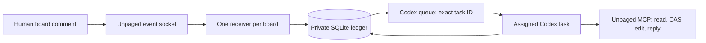

# Codex review adapter

Base: `b680a00a440866af268c9f6fb35d5c05416ff3d9` in the Unpaged plugin repository.
The implementation lives in a separate `plugins/unpaged-codex` package.
The existing Claude implementation and remote Unpaged server are unchanged.

## Ownership and data flow



The receiver transports routing facts. It does not interpret comments or hold
the user's OAuth credentials. The agent reads content and changes the board only
through remote MCP. The local CLI is bookkeeping for the already-authorized
review, not a command interface exposed to collaborators.

SQLite transactions serialize event claims across local processes; WAL and FULL
synchronization save work before queue side effects. Each board has one immutable
task binding and one worker owner token. Dead-worker recovery never overwrites a
live owner's lease. A displaced worker cannot report a result for its successor.
Local fencing does not claim global ownership across machines.

Event state separates transport and board effects:

```text
received -> dispatching -> queued -> processing -> completed
                 |                       |
          queue_uncertain         effect_uncertain
```

The agent may begin while enqueueing is still returning: the queue can deliver
before the CLI acknowledges it. A late queue receipt must preserve processing
or completed state. Received events wait while an earlier event is outstanding.
Completed event IDs remain deduplication receipts. Reconciliation and explicit
recovery carry evidence; they do not erase history or silently retry effects.

## Acceptance

The full content hash is the baseline; the short label is for human recognition.
The digest includes document title and all node content/elements except named
status elements and volatile transport metadata. Accepted versions store the
owner event and full digest. Unknown pending work or source drift blocks
acceptance. The exact acceptance phrase is intentionally explicit until Unpaged
has a first-class versioned acceptance UI. Acceptance grants no implementation
permission and no authority to resolve human threads.

## Runtime contracts and limits

The public Codex queue command persists a message and wakes an already-loaded
task. It does not load an arbitrary closed task. The adapter uses no desktop
private API, second model process, managed daemon, or alternate task. A normal
task reopen/resume loads the queue; a trusted SessionStart hook repairs the
receiver. Stop is a turn boundary and therefore is not wired to listener teardown.
See [official Codex hooks](https://learn.chatgpt.com/docs/hooks).

WebSocket open is transport readiness, not a server authentication receipt.
Unpaged may upgrade before closing a rejected listener. Durable work received
earlier can be queued before that close is observed. A terminal close fences
new agent begins immediately; the operator's stop command fences locally before
remote revocation. Zero stale wakeups during a remote-revocation race is not a
provided guarantee.

Codex enqueue is not idempotent: each invocation gets a new queue UUID. A timeout
can follow a successful enqueue. Queue listing alone cannot prove non-delivery
because a consumed item disappears. Ambiguous sends stay blocked pending proof.

Unpaged currently marks socket delivery separately from agent completion, offers
limited replay, and can lose event creation on an upstream trigger failure.
Replies generate new IDs and cannot atomically commit with edits and receipts.
The adapter records gaps and ambiguous effects; it cannot remove those server
limits. The minimum future server seam is exact feedback reads with identity,
retryable/reconciled event creation, and an idempotent bounded review commit
(source feedback + expected element revisions + edits + reply + result receipt).
That is an explicit release gate, not an implicit expansion of this plugin patch.

## Verification gates

Automated tests must cover duplicate frames, fixed task routing, write-before-send,
worker ownership, two review rounds, reconstructed database state, uncertain
enqueue/effects, late queue receipts, owner-only version acceptance, pending/gap
acceptance rejection, revocation/takeover, and secret-free status/prompts.

Installed-package evidence still requires trusted hook loading, a live comment
after turn completion, another later comment, a receiver restart, a Codex restart
and task reopen, and explicit acceptance stopping only the assigned review.
Tests with synthetic clocks establish state behavior across time, not actual
hours of wall-clock uptime or operating-system sleep recovery.
