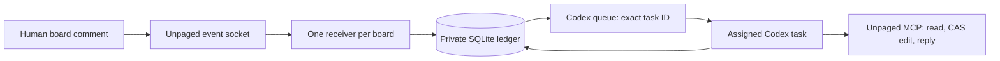

# Codex review adapter

Claude parity baseline: `34ebef185dcca4230b7690bfca791904624c6e41` in the
Unpaged plugin repository, inspected on 2026-09-19.
The implementation lives in a separate `plugins/unpaged-codex` package.
The remote Unpaged server and current Claude package are unchanged. The Codex
workflow adds Decision logs and as-built records to the durable review adapter.
Canvas approval is separate from the task user's permission to implement.

## Ownership and data flow



The receiver transports routing facts. It does not interpret comments or hold
the user's OAuth credentials. The agent reads content and changes the board only
through remote MCP. The local CLI is bookkeeping for the already-authorized
review, not a command interface exposed to collaborators.

SQLite transactions serialize event claims across local processes; WAL and FULL
synchronization save work before queue side effects. Each board has one immutable
task binding and one worker owner token. The worker identity includes the host
boot and process start identity as well as its PID. Recovery can distinguish PID
reuse from a still-running owner on supported macOS and Linux hosts. Windows
identity is unsupported. An unavailable identity, including a live legacy PID
without a stored identity, raises `worker_identity_unverifiable`; preserve that
process and make an explicit recovery decision. Dead-worker recovery never overwrites a live owner's lease. A displaced
worker cannot report a result for its successor.
Local fencing does not claim global ownership across machines.

Event state separates transport and board effects:

```text
received -> dispatching -> queued -> processing -> completed
                 |                       |
          queue_uncertain         effect_uncertain
```

The agent may begin while enqueueing is still returning: the queue can deliver
before the CLI acknowledges it. A late queue receipt must preserve processing
or completed state. Received events wait while an earlier event is outstanding.
Completed event IDs remain deduplication receipts. Reconciliation and explicit
recovery carry evidence; they do not erase history or silently retry effects.

## Acceptance

The full content hash is the internal baseline. Codex displays PROPOSED,
ACCEPTED, EXECUTING or BUILT in a separate status element. The owner can approve
on the canvas with `@agent I accept this plan`. The assigned task user can also
approve through chat; the adapter stores bounded evidence for that decision.
The parser allows whitespace, line breaks, an optional `@agent:` prefix, and
trailing periods/exclamation marks. It recognizes a standalone statement, not a
substring: quotation, questions, negation and conditions are not acceptance.
The old version-hash phrase remains valid only for its matching current digest.

The digest includes documented document/node/element content fields and the
complete plugin-owned `properties` payload; only the designated status elements
are excluded. Unknown top-level server metadata is ignored. Adding a new domain
content field requires updating this allowlist and its regression tests. A
persisted baseline from an older digest algorithm may differ: defer acceptance
and explicitly rebaseline after a human review rather than silently accepting it.
Node IDs use locale-independent code-unit order, and streamed JSON is decoded
after collecting its bytes. Baselines produced with locale-sensitive ordering
or split-character corruption may differ after this correction; preserve their
receipts and use the existing phase-appropriate submission/checkpoint flow after
verified full readback. Never silently replace an accepted digest.

Acceptance records the owner event and full digest after a fresh board read.
Unknown pending work, source drift or an unresolved reconciliation gap blocks it.
The caller passes `humanCreatedAt` from the matched full MCP message; missing or
invalid values refuse acceptance. Inbox `createdAt` is emission time, so a delayed
trigger cannot prove when its human approval was written. The actual comment
timestamp may precede the local baseline timestamp by at most five
seconds to tolerate small server/client clock differences. Larger skew still
requires verification; this is not a server-timestamp guarantee. The content
and ownership checks remain mandatory within that tolerance. Independently,
`event.received_at` must be at or after local `plan_version_at`, without a
tolerance. Both timestamps use the local clock, so an event already received
before a revision cannot become acceptance of the newer baseline.

## Plan and listener lifecycle

Listener state and plan phase are separate. A new binding stays `active` through
`proposed → accepted → executing → built`; only an explicit stop, revocation,
takeover or protocol rejection ends its receiver. `accept` records an owner
comment; `approve` records an explicit task-user plan approval. Both require a
fresh matching digest, no pending events and no reconciliation gap. The canvas
acceptance event itself must finish its reply and receipt before later work.

`execute` requires task-user implementation authorization, an accepted current
baseline and no pending/reconciliation work. The skill records the user's
instruction as evidence. No local flag can authenticate prose by itself: this
is trusted agent bookkeeping, and untrusted canvas comments never invoke it.
There is no invented Codex ExitPlanMode hook. Approval is handled explicitly in
the same task, while SessionStart restores its binding and phase after resume
or compaction. Claude's existing ExitPlanMode hook remains unchanged.

All canvas content except the designated status element stays in the digest,
including the Decision log and as-built records. `checkpoint` records verified
canvas progress during executing/built. `submit` refreshes a task-authored
proposal baseline before execution and requires fresh approval, retaining earlier
receipts even if the content hash is unchanged. Approval receipts retain the baseline
that was accepted; a changing current digest does not retroactively approve new
content. A content change while accepted returns the phase to proposed, and
reapproval appends history. During implementation, the task's existing authority
still determines which changes are allowed; the phase is not a grant of scope.

The as-built skill reads the exact Git range and plan, then creates a dated
record. Reasons are identified as recorded, reconstructed, or not recorded.
Partial records checkpoint progress without advancing the phase. `built` records
a verified complete record node and zero open tasks only from executing; the
agent must verify those facts from the canvas and code before invoking it.
Existing unbound or non-executing plans may receive factual records without
fabricating implementation authorization or changing their phase.

A 0.2 binding already in terminal `accepted` state stays terminal. Its pending
cleanup and receipts survive migration; neither migration nor SessionStart
restarts that listener or mints a replacement key. A live old retained runtime
must be deliberately quiesced and reconciled before the new helper opens its
ledger. Before schema changes, migration rejects live or unverifiable legacy
workers (`legacy_worker_upgrade_required`) and every unfinished legacy event
(`legacy_events_upgrade_required`). The original helper must establish the old
receipts first; migration never acknowledges or drops work on the user's behalf.
This guard applies to SessionStart too, which otherwise opens the store before
it can check worker ownership. Retaining code is not an automatic lifecycle migration.

The current server exposes unresolved threads without individual message IDs.
An event has a comment ID and historical author role, but the agent cannot always
join that identity to the full read. Ambiguous feedback must defer. Claude
currently reopens resolved reply threads; Codex does not do so without an exact
authorized read. This remains an explicit backend parity gap, not a reason to
attribute all messages in a thread to one owner's event.

## Runtime contracts and limits

The public Codex queue command persists a message and wakes an already-loaded
task. It does not load an arbitrary closed task. The adapter uses no desktop
private API, second model process, managed daemon, or alternate task. A normal
task reopen/resume loads the queue; a trusted SessionStart hook repairs the
receiver. Stop is a turn boundary and therefore is not wired to listener teardown.
See [official Codex hooks](https://learn.chatgpt.com/docs/hooks).

`doctor` queries the verified native binary through a temporary public
`app-server --stdio` connection: initialize, initialized, then `hooks/list` for
the current folder. It starts no task, invokes no hook, changes no trust, and
does not open the ledger. Output and duration are bounded, the owned query
process is terminated, and only sanitized Unpaged setup facts leave the helper.
Select the current installed source path before checking ambiguity, so another
marketplace's copy cannot block this one. Readiness requires the exact current installed SessionStart command and matcher,
enabled and trusted. Missing, disabled, modified, untrusted, unsupported and
uninspectable states fail closed with one appropriate next action. Folder-wide
load errors/warnings produce `configuration_problem` with a folder-configuration
action, not misleading Unpaged approval advice. Native warnings are unstructured
strings and are not attributed to a plugin by guessing their text. `arm` repeats
the check before opening/migrating state or binding; the skill checks before key
creation and revokes a newly minted key if arming subsequently fails.

Setup evidence is persisted configuration, not desktop in-memory state or a
live recovery receipt. Queued work keeps its retained runtime; setup inspection
uses the current installed plugin. Approval failure does not tear down an
existing receiver or erase its binding. Changed hook definitions require native
reapproval. On the tested Codex 0.155.0-alpha.9.2 build, read-only native hash
probes matched the raw `${PLUGIN_ROOT}` command template before expansion;
changing `startup|resume` to `startup|resume|compact` exactly reproduced the
old/new trust hashes. This isolates the pilot's approval reset, but does not
replace an installed-update trial on each supported host.

WebSocket open is transport readiness, not a server authentication receipt.
Unpaged may upgrade before closing a rejected listener. Durable work received
earlier can be queued before that close is observed. A terminal close fences
new agent begins immediately; the operator's stop command fences locally before
remote revocation. Zero stale wakeups during a remote-revocation race is not a
provided guarantee.

Codex enqueue is not idempotent: each invocation gets a new queue UUID. A timeout
can follow a successful enqueue. A successful receipt requires exit code zero
and exactly two distinct UUIDs: the expected task and the queue ID. Surrounding
stdout prose is not a contract; wrong or ambiguous IDs remain uncertain.
Queue listing alone cannot prove non-delivery because a consumed item disappears. Ambiguous sends stay blocked pending proof.

Unpaged currently marks socket delivery separately from agent completion, offers
limited replay, and can lose event creation on an upstream trigger failure.
Replies generate new IDs and cannot atomically commit with edits and receipts.
The adapter records gaps and ambiguous effects; it cannot remove those server
limits. The minimum future server seam is exact feedback reads with identity,
retryable/reconciled event creation, and an idempotent bounded review commit
(source feedback + expected element revisions + edits + reply + result receipt).
That is an explicit release gate, not an implicit expansion of this plugin patch.

## Verification gates

New receivers run from a retained, content-addressed copy under
`<data-directory>/runtimes/<hash>/`, containing the runtime dependency closure
and all three skills. Queue prompts reference its CLI and review skill. Copies are
published atomically, checked before reuse, and never automatically removed;
plugin cache replacement cannot invalidate a retained queued operation. Tests
remove the source cache and continue from the retained copy.

This does not retroactively move an older live cache-based receiver or repair an
already queued legacy path. Those reviews need explicit reconciliation and a
controlled stop/migration with their old files preserved. The recorded controlled
0.3.0 migration had no unfinished events. A native package update with pending
feedback still needs an installed-package trial.

Automated tests must cover duplicate frames, fixed task routing, write-before-send,
worker identity/PID reuse, cache deletion, two review rounds, reconstructed
database state, uncertain enqueue/effects, late queue receipts, owner-only version acceptance, pending/gap
acceptance rejection, acceptance text, actual human timestamps and delayed triggers, bounded clock
skew, nonterminal acceptance,
phase transitions, immutable approval history, legacy terminal migration,
compaction context, revocation/takeover, and
secret-free status/prompts.

Customer setup and recovery acceptance matrix:

| Scenario | Required observation |
| --- | --- |
| Fresh install, untrusted hook | One native Trust action; no key, binding or receiver before readiness. |
| Changed hook after update | Old approval fails; existing key, task, phase and receipts survive; exact new definition requires Trust. |
| Unchanged trusted hook update | Ready without another approval prompt; installed update preserves existing review state. |
| Native restart and task reopen | Receiver recovers automatically with the same binding and phase; a real comment gets one verified reply. |
| Render-only with untrusted hook | Canvas is created without listener setup or a Trust requirement. |
| Missing, disabled or unreadable hook | Accurate next action; no automatic trust/config changes or repeated restart instructions. |

The automated setup fixtures cover status detection, refusal before ledger
access, redaction and subprocess failures. They do not exercise the native Trust
button or prove automatic recovery. For a no-manual-repair trial, never invoke
`resume` or `session-start` directly to obtain a passing result.

Official [hook documentation](https://learn.chatgpt.com/docs/hooks) defines
`${PLUGIN_ROOT}` and the SessionStart `session_id`/`source` fields. Official
[plugin packaging](https://developers.openai.com/plugins/build/plugins) documents
`.app.json`, `apps` and `interface`.

The [September 19 installed trial](../../docs/codex-installed-trial-2026-09-19.md)
records exact versions and observations on one macOS host with an existing
registered connection. Version 0.3.0 covered rendering, idle and busy review,
acceptance with continued feedback, authorized implementation, Decision logs,
and partial and complete as-built records. Version 0.3.1 preserved approval
across an unchanged-hook update, delivered native SessionStart context and
automatically restored that same BUILT review after a real app restart/task
reopen, then handled a fresh human comment with one read-only reply. No manual
listener start or wake was used for that recovery/comment trial. It was not a
clean-profile installation or a full 0.3.1 lifecycle rerun.

Release readiness still requires the [maintainer runbook's remaining gates](../../docs/codex-connection-readiness.md):
public customer availability, clean-profile installation/sign-in, controlled
authentication and fault recovery, an installed update with unfinished work,
and explicit stop/revocation cleaning up only the assigned review. Exact comment
identity, current authority and resolved-history reads remain backend gates.
Tests with synthetic clocks establish state behavior across time, not actual
hours of wall-clock uptime or operating-system sleep recovery.
