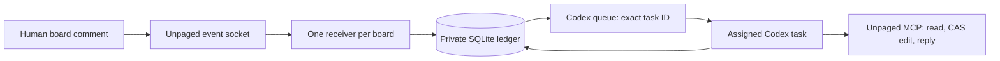

# Codex review adapter

Base: `b680a00a440866af268c9f6fb35d5c05416ff3d9` in the Unpaged plugin repository.
The implementation lives in a separate `plugins/unpaged-codex` package.
The remote Unpaged server is unchanged. Both host packages use the same review
policy: PROPOSED → ACCEPTED, owner acceptance, human thread resolution, and
separate authorization to implement.

## Ownership and data flow



The receiver transports routing facts. It does not interpret comments or hold
the user's OAuth credentials. The agent reads content and changes the board only
through remote MCP. The local CLI is bookkeeping for the already-authorized
review, not a command interface exposed to collaborators.

SQLite transactions serialize event claims across local processes; WAL and FULL
synchronization save work before queue side effects. Each board has one immutable
task binding and one worker owner token. The worker identity includes the host
boot and process start identity as well as its PID. Recovery can distinguish PID
reuse from a still-running owner on supported macOS and Linux hosts. Windows
identity is unsupported. An unavailable identity, including a live legacy PID
without a stored identity, raises `worker_identity_unverifiable`; preserve that
process and make an explicit recovery decision. Dead-worker recovery never overwrites a live owner's lease. A displaced
worker cannot report a result for its successor.
Local fencing does not claim global ownership across machines.

Event state separates transport and board effects:

```text
received -> dispatching -> queued -> processing -> completed
                 |                       |
          queue_uncertain         effect_uncertain
```

The agent may begin while enqueueing is still returning: the queue can deliver
before the CLI acknowledges it. A late queue receipt must preserve processing
or completed state. Received events wait while an earlier event is outstanding.
Completed event IDs remain deduplication receipts. Reconciliation and explicit
recovery carry evidence; they do not erase history or silently retry effects.

## Acceptance

The full content hash is the internal baseline. The visible status is PROPOSED
or ACCEPTED in both plugins, and the owner comments `@agent I accept this plan`.
The parser allows whitespace, line breaks, an optional `@agent:` prefix, and
trailing periods/exclamation marks. It recognizes a standalone statement, not a
substring: quotation, questions, negation and conditions are not acceptance.
The old version-hash phrase remains valid only for its matching current digest.

The digest includes documented document/node/element content fields and the
complete plugin-owned `properties` payload; only the designated status elements
are excluded. Unknown top-level server metadata is ignored. Adding a new domain
content field requires updating this allowlist and its regression tests. A
persisted baseline from an older digest algorithm may differ: defer acceptance
and explicitly rebaseline after a human review rather than silently accepting it.

Acceptance records the owner event and full digest after a fresh board read.
Unknown pending work, source drift or an unresolved reconciliation gap blocks it.
The comment timestamp may precede the local baseline timestamp by at most five
seconds to tolerate small server/client clock differences. Larger skew still
requires verification; this is not a server-timestamp guarantee. The content
and ownership checks remain mandatory within that tolerance. Independently,
`event.received_at` must be at or after local `plan_version_at`, without a
tolerance. Both timestamps use the local clock, so an event already received
before a revision cannot become acceptance of the newer baseline.

The Claude command retains its submitted content baseline and acceptance evidence
in session context; it does not claim Codex's durable acceptance receipt. Its
ExitPlanMode hook only projects a previously verified explicit acceptance onto
an unchanged board. Plan-mode exit alone neither accepts the plan nor authorizes
implementation. Neither plugin resolves or reopens human comment threads.

## Runtime contracts and limits

The public Codex queue command persists a message and wakes an already-loaded
task. It does not load an arbitrary closed task. The adapter uses no desktop
private API, second model process, managed daemon, or alternate task. A normal
task reopen/resume loads the queue; a trusted SessionStart hook repairs the
receiver. Stop is a turn boundary and therefore is not wired to listener teardown.
See [official Codex hooks](https://learn.chatgpt.com/docs/hooks).

WebSocket open is transport readiness, not a server authentication receipt.
Unpaged may upgrade before closing a rejected listener. Durable work received
earlier can be queued before that close is observed. A terminal close fences
new agent begins immediately; the operator's stop command fences locally before
remote revocation. Zero stale wakeups during a remote-revocation race is not a
provided guarantee.

Codex enqueue is not idempotent: each invocation gets a new queue UUID. A timeout
can follow a successful enqueue. A successful receipt requires exit code zero
and exactly two distinct UUIDs: the expected task and the queue ID. Surrounding
stdout prose is not a contract; wrong or ambiguous IDs remain uncertain.
Queue listing alone cannot prove non-delivery because a consumed item disappears. Ambiguous sends stay blocked pending proof.

Unpaged currently marks socket delivery separately from agent completion, offers
limited replay, and can lose event creation on an upstream trigger failure.
Replies generate new IDs and cannot atomically commit with edits and receipts.
The adapter records gaps and ambiguous effects; it cannot remove those server
limits. The minimum future server seam is exact feedback reads with identity,
retryable/reconciled event creation, and an idempotent bounded review commit
(source feedback + expected element revisions + edits + reply + result receipt).
That is an explicit release gate, not an implicit expansion of this plugin patch.

## Verification gates

New receivers run from a retained, content-addressed copy under
`<data-directory>/runtimes/<hash>/`, containing the runtime dependency closure
and both skills. Queue prompts reference its CLI and review skill. Copies are
published atomically, checked before reuse, and never automatically removed;
plugin cache replacement cannot invalidate a retained queued operation. Tests
remove the source cache and continue from the retained copy.

This does not retroactively move an older live cache-based receiver or repair an
already queued legacy path. Those reviews need explicit reconciliation and a
controlled stop/migration with their old files preserved. This patch does not
change an installed binding or run that migration. A native package update with
pending feedback still needs an installed-package trial.

Automated tests must cover duplicate frames, fixed task routing, write-before-send,
worker identity/PID reuse, cache deletion, two review rounds, reconstructed
database state, uncertain enqueue/effects, late queue receipts, owner-only version acceptance, pending/gap
acceptance rejection, acceptance text and clock skew, revocation/takeover, and
secret-free status/prompts.

Official [hook documentation](https://learn.chatgpt.com/docs/hooks) defines
`${PLUGIN_ROOT}` and the SessionStart `session_id`/`source` fields. Official
[plugin packaging](https://developers.openai.com/plugins/build/plugins) documents
`.app.json`, `apps` and `interface`. The pilot task's shell exposed the expected
`CODEX_THREAD_ID`, and the earlier installed package delivered native SessionStart
binding context. These observations validate those pilot host assumptions, not
the complete revised package.

Keep this PR in draft until the Claude package is public and tagged and this
revised build has a fresh native installation, trusted hook pickup and a live
comment waking the assigned idle task. Public release also requires the remaining
installed lifecycle trials. Those trials include a live comment after turn completion, another later comment, a receiver restart, a Codex restart
and task reopen, and explicit acceptance stopping only the assigned review.
Tests with synthetic clocks establish state behavior across time, not actual
hours of wall-clock uptime or operating-system sleep recovery.
