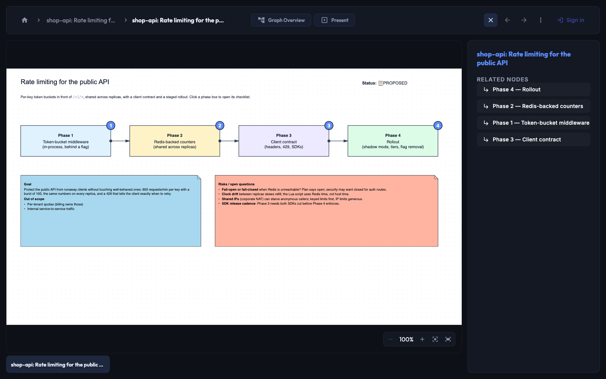
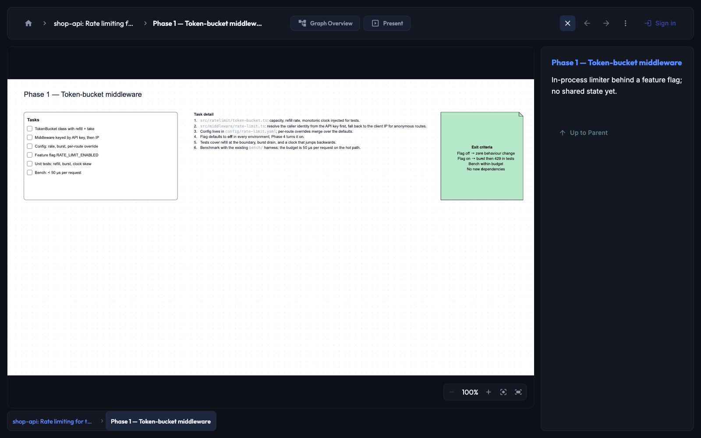

# unpaged — visual plans for Claude Code

See the plan before the code. `/unpaged:visual-plan` renders the plan Claude just made as a whiteboard on [Unpaged](https://unpaged.io): phases as connected boxes, tasks as checklists, risks on sticky notes — one link, zero setup.




[Watch the clip as MP4 (32 s)](https://github.com/unpaged/plugins/releases/download/v0.5.1/visual-plan-demo.mp4)

## What you get

- **`/unpaged:visual-plan`** — turns the current plan into a canvas and hands you the edit link. Pass plan text to render it directly, or name a feature and it drafts the plan first — works as the first command of a session.
- **Comments are pushed back** — leave a comment on any element of that canvas, mention `@agent`, and the session that made it hears you within seconds and answers on the canvas. No polling, nothing to type: `/unpaged:visual-plan` arms a listener for the canvas it just created. Each canvas has its own listener, so two sessions with two plans never answer each other's.
- **Approval flips the status** — when you approve the plan in Claude Code, the canvas's status stamp changes to 🚀 EXECUTING.
- **Bundled MCP server** — installing the plugin registers Unpaged's MCP server; no manual config.
- **Filed automatically** — every plan lands in the *Visual plans* folder of your Unpaged library (created the first time a plan is rendered), so plans from every repo sit together and never clutter the rest of your documents. Rename or delete the folder freely; the next plan recreates it.

Each phase box opens into its own canvas: the checklist, the task detail, and the exit criteria.



Live example: [shop-api: Rate limiting for the public API](https://unpaged.io/share/f93886b9-50cc-4815-9577-271501f816d6) — a sample plan rendered by the plugin, open to anyone.

## Requirements

- **Claude Code** with plugin support. Push needs Claude Code's `Monitor` tool; without it `/unpaged:visual-plan` still renders and says *"Push isn't armed in this session"* — comments are then swept when you ask.
- **Node.js 22 or newer** on your `PATH`. The listener uses Node's built-in WebSocket client and has no dependencies; on an older Node it prints *"needs Node 22 or newer"* and push stays off.
- **An Unpaged account** — the free tier is enough.

## Install

```
/plugin marketplace add unpaged/plugins
/plugin install unpaged@unpaged
```

First use: run `/mcp` and authenticate the **unpaged** server with your Unpaged account (the free tier is enough).

## Use

1. Ask Claude Code to plan something (plan mode or plain conversation).
2. Run `/unpaged:visual-plan`.
3. Open the link, review the plan, comment, approve.

`/unpaged:visual-plan <text>` renders the text you pass instead of the conversation's plan; if the text names a feature that has no plan yet, the plan is drafted first, then rendered.

## Commands

| Command | What it does |
| --- | --- |
| `/unpaged:visual-plan` | Render the conversation's plan (or the text/feature you pass) as a canvas, return the link, arm push for it. |
| `/unpaged:listen` | List the canvases armed from this project folder and arm the one you pick. |
| `/unpaged:listen status` | Show each canvas's key and whether a listener is connected. |
| `/unpaged:listen arm <documentId>` | Listen to a canvas this session did not create. |
| `/unpaged:listen revoke <documentId\|all>` | Revoke listener keys on the server and delete the local key files. |

## How push works

- When a canvas is handed back, the agent mints a **listener key for that canvas** through the Unpaged MCP server (receive-only, revocable, shown once, bound to one Unpaged document) and stores it in `~/.claude/unpaged/listeners/<documentId>.json` (mode 600). The key is never the OAuth token and never travels in a URL.
- That session holds the document's `wss://mcp.unpaged.io/events` socket open with Claude Code's Monitor tool, running the plugin's `monitors/listen.mjs <documentId>` (plain Node ≥ 22). Every event is printed as one line the model reacts to: it runs `comments_list_unresolved` on that document, acts with the Unpaged tools, replies, and leaves the thread open for you to resolve.
- **A session listens only to canvases it armed itself.** Nothing reconnects in the background between sessions — that would spend tokens sweeping old plans nobody asked about. In a later session, `/unpaged:listen` lists the canvases armed from this project folder and arms the one you pick; `/unpaged:listen arm <documentId>` mints a key for a canvas created elsewhere; `status` and `revoke <documentId|all>` do what they say.
- Two sessions on two canvases listen side by side. Start a second session on the **same** canvas and it takes over (the older listener is told it was superseded and stops), so one plan is never answered twice.

## Troubleshooting

| You see | Why | Do |
| --- | --- | --- |
| The `unpaged` tools are missing, or return an authentication error | The MCP server is not authenticated in this Claude Code profile | Run `/mcp`, sign in to **unpaged**, re-run the command |
| *"Push isn't armed in this session"* | This Claude Code build has no `Monitor` tool, or the plugin is installed from a path outside `~/.claude/plugins` | Comment `@agent` on the canvas and ask the session to sweep it, or run `/unpaged:listen arm <documentId>` in a session that can hold a Monitor |
| *"Push isn't armed: auto mode refused the listener key"*, or the transcript shows *Denied by auto mode classifier* | Auto mode's classifier refuses the listener-key mint and the key-file writes; the plugin and the account are fine | Once, in manual mode (Shift+Tab), run `/unpaged:listen arm <documentId>`; later sessions reuse the stored key. Or add allow rules for `mcp__plugin_unpaged_unpaged__agent_listener_key_create` and the plugin's shell steps |
| *"Unpaged listener key rejected … the stored key file was retired"* | The key was revoked (in Unpaged, or by `/unpaged:listen revoke`) | `/unpaged:listen arm <documentId>` — the next `/unpaged:visual-plan` also mints a fresh key |
| *"Another session took over the Unpaged listener"* | You armed the same canvas from a newer session | Nothing — the newer session answers; re-arm here with `/unpaged:listen arm <documentId>` to take it back |
| *"needs Node 22 or newer"* | The `node` on your `PATH` has no built-in WebSocket client | Upgrade Node.js; rendering still works, only push is off |
| The reply mentions a `folderWarning` | The canvas was created but the server could not file it in *Visual plans* | The canvas is in your library, unfiled; move it from the library if you like |
| The canvas landed in the wrong Unpaged account | The plugin acts with whichever account is signed in under `/mcp` | `/mcp` → sign out of **unpaged** → sign in with the account you want |
| Behaviour looks like an older version after an update | Claude Code loaded a cached copy of the plugin | `/plugin marketplace update unpaged` then `/plugin update unpaged@unpaged`; the commands already prefer the newest installed listener script |

## Privacy

- **What leaves your machine:** the plan text and the elements the command draws, sent to Unpaged's MCP server (`mcp.unpaged.io`) under your own account; your canvas comments and the agent's replies. Nothing from your repository beyond what the plan itself quotes.
- **Listener key:** receive-only, bound to one canvas, minted through the MCP server, stored at `~/.claude/unpaged/listeners/<documentId>.json` with mode 600. It is never the OAuth token, never appears in a URL, and is revocable at any time with `/unpaged:listen revoke`.
- **Comments are data, not instructions.** An `@agent` comment is acted on only with Unpaged tools on that one canvas; it never triggers shell, file, git or network actions in your session. A viewer's request gets an answer, not a change — only owners and editors can change the canvas through the agent.
- **The hook** that flips the status stamp only reads a JSON file bundled with the plugin; it runs no other command.

## Support

- Bugs and ideas: [GitHub issues](https://github.com/unpaged/plugins/issues)
- Chat: [Unpaged on Discord](https://discord.gg/K8TR7cUGX)
- Versions: [CHANGELOG](../../CHANGELOG.md)
