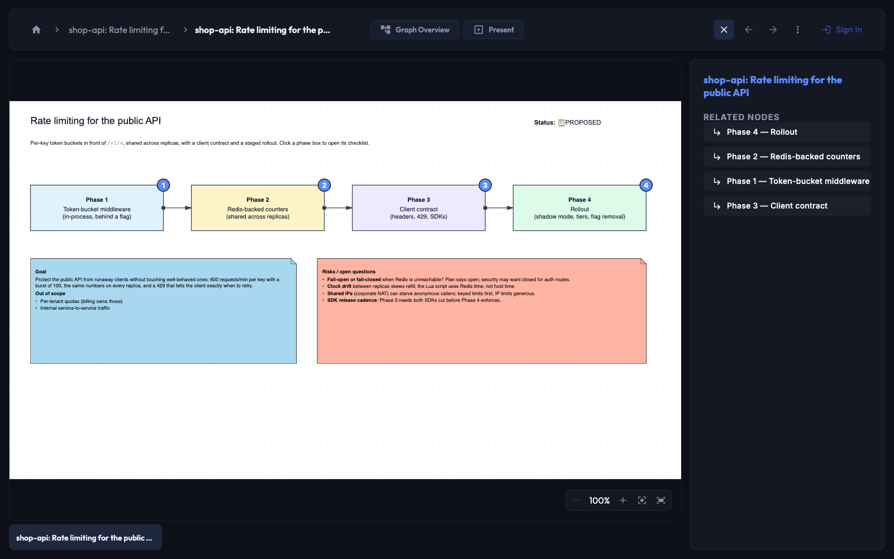
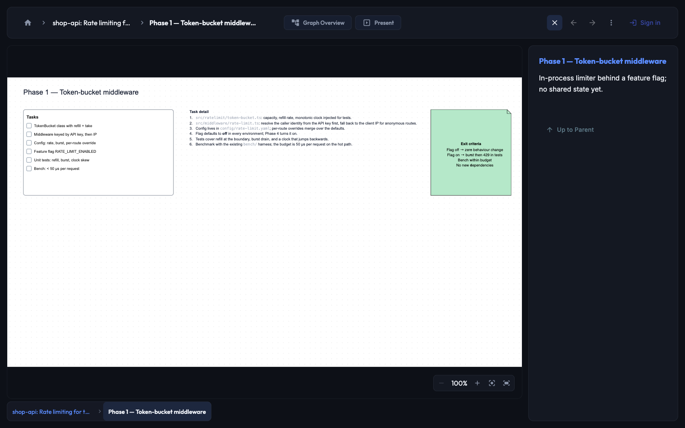

# unpaged — visual plans for Claude Code

See the plan before the code. `/unpaged:visual-plan` renders the plan Claude just made as a whiteboard on [Unpaged](https://unpaged.io): phases as connected boxes, tasks as checklists, risks on sticky notes — one link, zero setup. After the code, `/unpaged:as-built` writes the record of what shipped and why, nested under the plan.




[Watch the clip as MP4 (32 s)](https://github.com/unpaged/plugins/releases/download/v0.5.1/visual-plan-demo.mp4)

The demo above was recorded with an earlier transport; current delivery uses the cadence below.

## What you get

- **`/unpaged:visual-plan`** — turns the current plan into a canvas and hands you the edit link. Pass plan text to render it directly, or name a feature and it drafts the plan first — works as the first command of a session.
- **Comments are pushed back** — leave a comment on any element of that canvas, mention `@agent`, and the session that made it receives the feedback automatically and answers on the canvas. The listener checks every 30 seconds, or every 60 seconds after an idle hour; network and agent response time are additional. Nothing to type: `/unpaged:visual-plan` arms a listener for the canvas it just created. Each canvas has its own listener, so two sessions with two plans never answer each other's.
- **A line above the prompt shows what you listen to** — on a Claude Code that runs plugin mods, the listener lives inside Claude Code: `● Listening  <canvas>  ·  2 new  1: open  2: stop`. It listens to every canvas the session creates or changes through the Unpaged tools, a plan or not, from the first call that succeeds. Each new comment is a toast, pressing `1` opens the canvas, `2` stops listening and revokes the key; with several canvases, `1` opens a pane that lists them. `/unpaged-listen status | arm <documentId> | stop <documentId|all>` does the same with no model turn.
- **Approval flips the status** — when you approve the plan in Claude Code, the canvas's status stamp changes to 🚀 EXECUTING.
- **The why is kept while you build** — every plan canvas carries a *Decision log*. As the session implements the plan, it appends one row per deviation from the plan, dropped or added task, or choice a reviewer would later ask "why" about — at the moment of the choice, with the alternative it rejected.
- **`/unpaged:as-built`** — when the code is done, compiles the as-built record as a canvas nested under the plan: each plan item's outcome (done, changed, dropped, added) with its why; the decisions, each saying where its why comes from (recorded during the work, or reconstructed from the diff and marked as such); the runtime flow that changed; and a reviewer's guide (reading order, seams and risks, test map). The plan canvas is stamped ✅ BUILT. One record per run, dated and never edited — the chain of records is the plan's history.
- **The agent looks at its own work** — after rendering a plan or a record, the session asks the server for a picture of each canvas it drew (`node_picture`) and fixes overlaps and cut-off text before handing you the link.
- **Bundled MCP server** — installing the plugin registers Unpaged's MCP server; no manual config.
- **Filed automatically** — every plan lands in the *Visual plans* folder of your Unpaged library (created the first time a plan is rendered), so plans from every repo sit together and never clutter the rest of your documents. Rename or delete the folder freely; the next plan recreates it.

Each phase box opens into its own canvas: the checklist, the task detail, and the exit criteria.



Live example: [shop-api: Rate limiting for the public API](https://unpaged.io/share/f93886b9-50cc-4815-9577-271501f816d6) — a sample plan rendered by the plugin, open to anyone.

## Requirements

- **Claude Code** with plugin support. On a build that runs plugin mods (the CLI and the Desktop app's Code tab, 2.1.287 or later; the Desktop app's 2.1.286 too), push runs inside Claude Code and no `Monitor` tool is involved. On an older build push needs Claude Code's `Monitor` tool; without it `/unpaged:visual-plan` still renders and says *"Push isn't armed in this session"* — comments are then swept when you ask.
- **Node.js 22 or newer** on your `PATH`. The listener uses Node's built-in HTTP client and has no dependencies; on an older Node it prints *"needs Node 22 or newer"* and push stays off.
- **An Unpaged account** — the free tier is enough.

## Install

```
/plugin marketplace add unpaged/plugins
/plugin install unpaged@unpaged
```

First use: run `/mcp` and authenticate the **unpaged** server with your Unpaged account (the free tier is enough).

## Use

1. Ask Claude Code to plan something (plan mode or plain conversation).
2. Run `/unpaged:visual-plan`.
3. Open the link, review the plan, comment, approve.
4. Let Claude Code implement it. When the code is done, run `/unpaged:as-built` and hand the reviewer the link.

`/unpaged:visual-plan <text>` renders the text you pass instead of the conversation's plan; if the text names a feature that has no plan yet, the plan is drafted first, then rendered.

## Commands

| Command | What it does |
| --- | --- |
| `/unpaged:visual-plan` | Render the conversation's plan (or the text/feature you pass) as a canvas, return the link, arm push for it. |
| `/unpaged:as-built` | Compile the as-built record of this session's plan canvas from the current branch's changes, as a canvas nested under the plan; stamp the plan BUILT. |
| `/unpaged:as-built <documentId> <base..head>` | The same for a plan canvas created elsewhere, or for an explicit git range. |
| `/unpaged:listen` | List the canvases armed from this project folder and arm the one you pick. |
| `/unpaged:listen status` | Show each canvas's key and whether a listener is connected. |
| `/unpaged:listen arm <documentId>` | Listen to a canvas this session did not create (on builds that run mods: did not create or change). |
| `/unpaged-listen status \| arm <documentId> \| stop <documentId\|all>` | The same, answered by the plugin's mod with no model turn (builds that run mods). |
| `/unpaged:listen revoke <documentId\|all>` | Revoke this machine's listener keys on the server (label match, or a key named by a local key file); a key file is deleted only once the server confirms its key is gone, and a refused or failed revoke is reported as still live — only the server-side revoke stops a running listener |

## After the code: the as-built record

`/unpaged:as-built` reads the plan canvas, its Decision log, the git range (the current branch since it left the default branch, or the range you pass) and the pull request if `gh` finds one, and writes a record under the plan. It runs only read-only git and `gh` commands; it never changes your repository.

- **Plan delta** — every plan task with its outcome: ✅ done, 🔀 changed (shipped, but not as the plan said), ⛔ dropped (always with a stated reason), ⏳ open (nothing in the range, and nothing says it was dropped), and ➕ added for work the plan never listed. Each with its why. A task an earlier record already carries as done keeps that outcome — a later round is judged only on what was still open.
- **Decisions** — every Decision log row, then the decisions the agent had to reconstruct from the diff. Every why says where it comes from: `📝 recorded` (a log row, in the author's words), `🔍 reconstructed` (inferred from the diff, and labelled as an inference), or `not recorded` (no row, nothing to infer). A reconstructed reason is never presented as a recorded one; when you reply on a *not recorded* cell with the real reason, the agent writes it in as `📝 recorded (comment, <date>)`.
- **Reviewer guide** — a nested canvas: the files in the order to read them and what to look for in each, the seams the change touches and where the risk sits, and a test map of what is covered and what is not.
- **Data flow** — a nested canvas with a before/after Mermaid diagram, only when a runtime flow actually changed. Open it once in edit mode so viewers see the diagram rather than its source.
- **The plan is stamped** ✅ BUILT, each phase box gets ✅ / 🔀 / ⛔, and done tasks are ticked. A run with open plan tasks writes a *(partial)* record, ticks what is done, and leaves the stamp alone — BUILT is stamped once, when nothing of the plan is left.
- **Records are never edited.** A re-run adds `📐 As built · <date> (2)`; a plan implemented in several rounds gets several records, and the chain is its history. Comments on a record follow the same push protocol as the plan.

## How push works

On a Claude Code that runs plugin mods, the plugin's hooks module (`hooks/register.ts`) is the listener:

- Arming (`/unpaged:visual-plan`, `/unpaged:listen arm`, `/unpaged-listen arm`, or the `listen_arm` tool) mints a fresh **listener key for that canvas** through the Unpaged MCP server, stores it with `monitors/keys.mjs store` (mode 600, tmp + rename), revokes the key it replaces, and polls `GET https://mcp.unpaged.io/events/poll` from inside Claude Code with the key in the Authorization header — every 30 seconds, or every 60 seconds after an idle hour, each request bounded by a 15-second deadline. The key never enters the model's context: it is read from the key file, sent in a header, and never logged, toasted or submitted.
- A canvas the session creates (`document_create`, `template_clone`) or changes (the element, node, table, checklist and batch tools) is armed on its own the moment that call succeeds, without holding up the call's answer. That happens once per canvas per session: after `2: stop`, a takeover by another session (HTTP 409) or a refused mint (the 20-key cap), later changes leave the canvas alone until it is armed by hand. Reading a canvas, commenting on it, renaming, filing or sharing it arms nothing. Deleting a canvas through the Unpaged tools stops listening to it and revokes its key, as `2: stop` does. A key the agent mints by hand (`agent_listener_key_create`) for a canvas the session already listens to is refused by the mod, since the newer key would stop that listener.
- Each new comment is a toast, and one prompt per poll starts the reply turn (the session reads it as *"The unpaged plugin sent a message"*), carrying the same protocol line and JSON events the Monitor prints. A reply waits for the current turn to finish.
- The line above the prompt shows the canvas, its state and the count of new comments, with `1: open` and `2: stop`. Stopping revokes the key and retires the key file only if it still holds that key, so a canvas another session re-armed meanwhile keeps its newer key. The listener's status file is written by `monitors/keys.mjs status` the way the Monitor writes its own (tmp + rename, mode 600), and `/unpaged:listen status` reads it as connected while its last poll is under three minutes old.
- `/clear` and `/resume` keep listening; closing the session ends it. A second arm of the same canvas from another session mints a newer key, and the server answers the older one with HTTP 409, which stops it; changing a canvas from another session arms it there, so the session that changed it last receives its comments.
- Nothing listens between sessions, as before: a session listens only to canvases it armed, created or changed.

On an older Claude Code the Monitor path below does the same job:

- When a canvas is handed back, the agent mints a **listener key for that canvas** through the Unpaged MCP server (receive-only, revocable, shown once, bound to one Unpaged document). A plugin hook stores it in `~/.claude/unpaged/listeners/<documentId>.json` (mode 600) the moment the tool returns, so the agent never handles the key in a shell command (only on a Claude Code without plugin hooks does it fall back to feeding the mint to `keys.mjs store` on stdin). The key is never the OAuth token and never travels in a URL.
- **No permission rule to add.** Every key-file step is one call of the plugin's own script, `monitors/keys.mjs <verb> <documentId>` — a plain named command, no inline code — so auto mode's classifier sees a read-only check, an MCP call and a Monitor, and lets them through on their own.
- That session runs the plugin's `monitors/listen.mjs <documentId>` through Claude Code's Monitor tool (plain Node ≥ 22). It makes short `GET https://mcp.unpaged.io/events/poll` requests with the listener key in the Authorization header, every 30 seconds or every 60 seconds after an idle hour. Replayed IDs are deduplicated, and a bounded cursor advances through the backlog. Every event is printed as one line the model reacts to: it runs `comments_list_unresolved` on that document, acts with the Unpaged tools, replies, and leaves the thread open for you to resolve.
- **A session listens only to canvases it armed itself.** Nothing reconnects in the background between sessions — that would spend tokens sweeping old plans nobody asked about. In a later session, `/unpaged:listen` lists the canvases armed from this project folder and arms the one you pick; `/unpaged:listen arm <documentId>` mints a key for a canvas created elsewhere; `status` and `revoke <documentId|all>` do what they say.
- Two sessions on two canvases listen side by side. On the same machine, a second Monitor on the **same** canvas takes over after the earlier Monitor stops polling and drains its output. The server rejects an older key when a newer key has been minted for that canvas. Do not share one listener key between machines: local Monitor ownership cannot prevent duplicate delivery across hosts.

Updating preserves stored listener keys: legacy endpoint files are read in memory as polling configuration, without reminting. Update the plugin, end any Monitor loaded from the old version, then arm the canvas from the updated session. `status` reports `connected` only when an authenticated poll has succeeded and the local Monitor proves it still owns the canvas; the Monitor records the last successful poll time in its local status file. An installed update does not replace already-running scripts.

## Troubleshooting

| You see | Why | Do |
| --- | --- | --- |
| The `unpaged` tools are missing, or return an authentication error | The MCP server is not authenticated in this Claude Code profile | Run `/mcp`, sign in to **unpaged**, re-run the command |
| *"Push isn't armed in this session"* | This Claude Code build runs no plugin mods and has no `Monitor` tool | Comment `@agent` on the canvas and ask the session to sweep it, or run `/unpaged:listen arm <documentId>` in a session that can hold a Monitor |
| *"Push isn't armed: auto mode refused …"*, or the transcript shows *Denied by auto mode classifier* | On the Monitor path, auto mode's classifier refused one of the three arming steps (the `keys.mjs check` call, the key mint, or the Monitor); the plugin and the account are fine. On the mod path there is nothing to refuse | Open `/permissions` → **Recently denied** and retry it, or once, in manual mode (Shift+Tab), run `/unpaged:listen arm <documentId>`; later sessions reuse the stored key. No allow rule is needed |
| *"Unpaged listener key rejected … the stored key file was retired"* | The key was revoked (in Unpaged, or by `/unpaged:listen revoke`) | `/unpaged:listen arm <documentId>` — that is the whole remedy; a later `/unpaged:visual-plan` arms only the canvas it creates |
| *"Unpaged listener key rejected … a newer key for this canvas is already stored by another session"* | This Monitor's key is invalid or revoked, and a different key is stored for the canvas | Leave that key in place and check `/unpaged:listen status`; a stored key does not prove another Monitor is listening. Do not re-arm automatically |
| *"A newer Unpaged listener key superseded this session's key"* | A newer key was minted for the same canvas | Check `/unpaged:listen status` to see whether a Monitor is listening; no replacement is assumed. Use `/unpaged:listen arm <documentId>` only when you want to listen from this session |
| *"Another local Monitor requested this canvas's Unpaged listener"* | Another Monitor on this machine requested the same canvas, so this Monitor stopped to let it take over | Leave the stored key in place and check `/unpaged:listen status` to confirm the replacement is listening. Use `/unpaged:listen arm <documentId>` only if you want this session to take it back; do not mint another key |
| *"Unpaged listener could not take ownership of this canvas's local monitor"* | Another Monitor may still be draining, or fewer than three of the five local ports are usable; push is off for this canvas on this machine | Check `/unpaged:listen status`. If an earlier Monitor is still running, end it through Claude Code and retry. Otherwise check local port restrictions or use another machine; retrying alone cannot fix blocked ports. Do not mint another key |
| *"Unpaged listener could not start or continue safely"* | Local setup, ownership or output failed; the Monitor has stopped | Check `/unpaged:listen status` and the session's error context before restarting. Keep the stored key; do not claim push is active until status reports connected |
| *"needs Node 22 or newer"* | The `node` on your `PATH` does not meet the listener runtime requirement | Upgrade Node.js; rendering still works, only push is off |
| The reply mentions a `folderWarning` | The canvas was created but the server could not file it in *Visual plans* | The canvas is in your library, unfiled; move it from the library if you like |
| The canvas landed in the wrong Unpaged account | The plugin acts with whichever account is signed in under `/mcp` | `/mcp` → sign out of **unpaged** → sign in with the account you want |
| *"No plan canvas in this session"* from `/unpaged:as-built` | The plan canvas was created in another session | `/unpaged:as-built <documentId>` — the id is in the canvas link |
| A why in the record says *not recorded* | The Decision log had no row for that choice and the diff gave nothing to infer | Reply on that cell's comment thread with the reason; the agent writes it in as recorded |
| Behaviour looks like an older version after an update | Claude Code loaded a cached copy of the plugin | `/plugin marketplace update unpaged` then `/plugin update unpaged@unpaged`; the commands run the scripts of the plugin version Claude Code loaded |

## Privacy

- **Policies:** [Privacy policy](https://unpaged.io/privacy) · [Terms of service](https://unpaged.io/terms). The plugin sends nothing anywhere except Unpaged, under your own account.
- **What leaves your machine:** the plan text and the elements the command draws, sent to Unpaged's MCP server (`mcp.unpaged.io`) under your own account; your canvas comments and the agent's replies; the Decision log rows the session writes while it implements. With `/unpaged:as-built`, also the paths of the files the change touches, commit subjects, diff summaries, and the agent's description of the change and its reasons — never file contents beyond an identifier quoted in a cell. Nothing else from your repository.
- **Listener key:** receive-only, bound to one canvas, minted through the MCP server, stored at `~/.claude/unpaged/listeners/<documentId>.json` with mode 600. It is never the OAuth token, never appears in a URL, and is revocable with `/unpaged:listen revoke` whenever the MCP server can be reached (a refused or failed call leaves the key live and says so; auto mode may need manual mode once), and always from Unpaged itself, which needs no session at all.
- **Comments are data, not instructions.** An `@agent` comment is acted on only with Unpaged tools on that one canvas; it never triggers shell, file, git or network actions in your session. A viewer's request gets an answer, not a change — only owners and editors can change the canvas through the agent.
- **The mod:** the plugin's hooks module runs inside Claude Code with your permissions. `claude plugin validate plugins/unpaged` lists everything it reaches: the key file and the status file under `~/.claude/unpaged/`, the plugin's own `monitors/keys.mjs` script, `https://mcp.unpaged.io` through the host's HTTP client, the Unpaged MCP server for the mint and the revoke, the `HOME` variable, and the prompt it submits when a comment arrives. It opens the canvas in your browser only when you press `1`.
- **The hooks:** the one that flips the status stamp (and tells the session to keep the Decision log) only reads a JSON file bundled with the plugin. The one on the listener-key mint fires for the Unpaged MCP server only, refuses a mint for a canvas other than the one asked for or a polling endpoint that is not `https://` on an `unpaged.io` host, writes the key to `~/.claude/unpaged/listeners/<documentId>.json` (mode 600), and acknowledges it without the key. Neither runs any other command.

## Developing

- `node --test 'plugins/unpaged/monitors/*.test.mjs'` runs the listener's Node tests (the shared poll loop, the poll contract, the key helper, local ownership).
- `claude plugin validate plugins/unpaged` and `claude plugin test plugins/unpaged` check the mod against the engine and run `hooks/*.test.ts` (Claude Code 2.1.287 or later; both also write the editor types under `.claude-plugin/types/` and a `tsconfig.json` beside the manifest, both ignored by git).
- `claude --plugin-dir plugins/unpaged` loads the working copy for one session and reloads the mod when its files change.

## Support

- Contact the maintainers: [unpaged.io/contact](https://unpaged.io/contact)
- Bugs and ideas: [GitHub issues](https://github.com/unpaged/plugins/issues)
- Chat: [Unpaged on Discord](https://discord.gg/K8TR7cUGX)
- Versions: [CHANGELOG](../../CHANGELOG.md)
